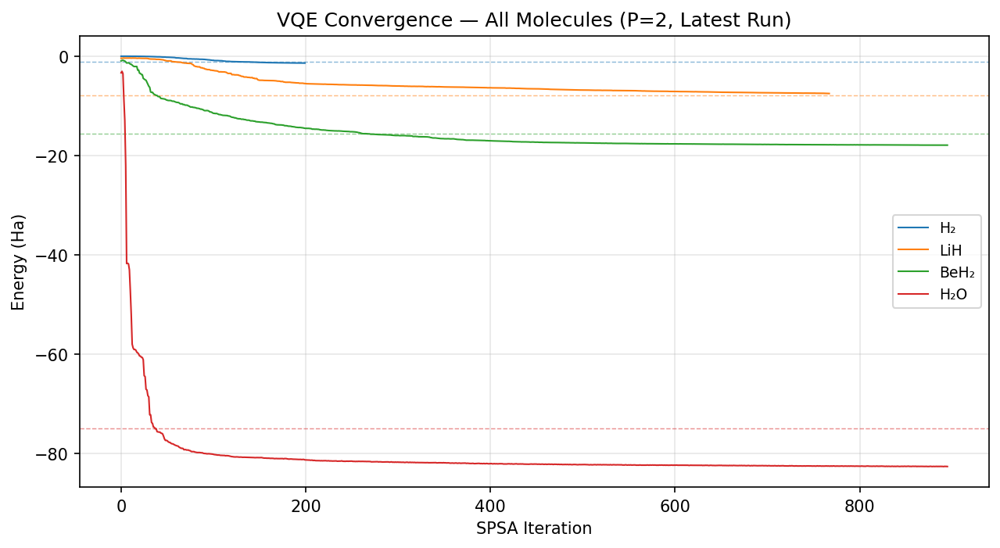
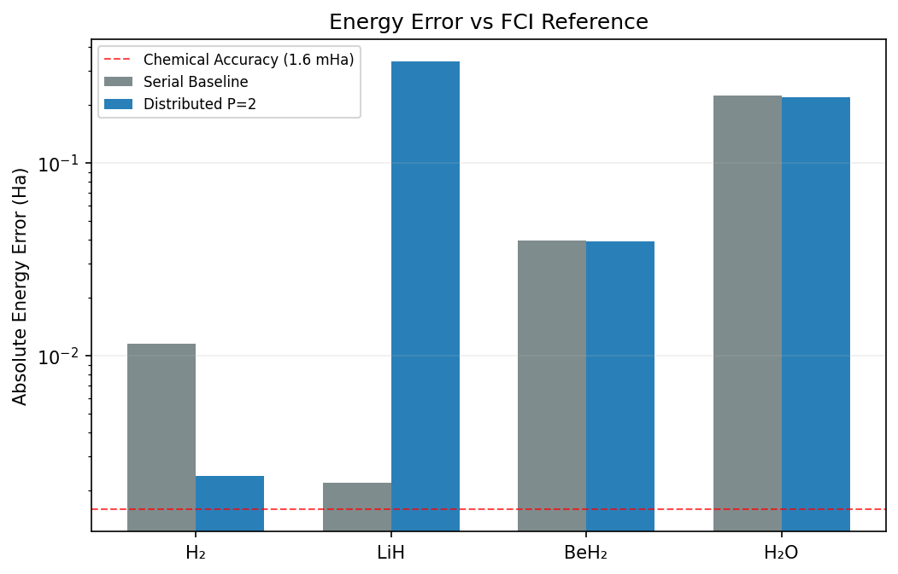

# Hybrid Quantum-Classical VQE Stack for HPC

**Bachelor's of Computer Science and Artificial Intelligence (BCSAI) Thesis — IE University**
**Anna Payne | Supervised by Prof. Oscar Diez**

A hybrid quantum-classical middleware stack that implements the Variational Quantum Eigensolver (VQE) with MPI parallelism, CUDA GPU acceleration, and IBM Quantum cloud integration. Designed for molecular ground-state energy computation with distributed Pauli-term evaluation across HPC resources, this stack addresses the middleware gap between distributed classical computation and cloud-based quantum backends.

---

## Quick Start

```bash
git clone <repo-url> && cd quantum_classical_VQE_algorithm
cp .env.example .env                 # Add IBM Quantum credentials (optional, for QPU runs only)
make build                           # Build Docker image (CUDA 12.6 + OpenMPI + Python 3.11)
make trial                           # 7 layer diagnostic test (simulator, 2 MPI ranks)
make example NP=2                    # Run template (H2 ground state, 2 MPI ranks)
make run NP=2                        # Full chemistry benchmark using molecule H2, LiH, BeH2, H2O
```

See [`template.py`](template.py) for a step-by-step walkthrough. See [`MOLECULES.md`](MOLECULES.md) for all available built-in molecules.

---

## Architecture

### Three-Layer Stack

```
Python API (src/api/)
   | QuantumProblem.prepare() -> Pauli Hamiltonian + parameterized ansatz
C++ Dispatcher (src/dispatcher/)
   | MPI_Ibcast parameters -> local compute -> MPI_Allreduce partial energies
CUDA Kernels (src/classical/cuda/)
   | Mixed-precision (FP32 trig -> FP64 accumulation) Pauli expectations
```

**Orchestration Layer** - Rank 0 holds the global SPSA optimizer state and broadcasts variational parameters $\theta^+$ and $\theta^-$ to all MPI ranks with `MPI_Ibcast` (non-blocking) in the C++ dispatcher and `comm.Bcast` / `comm.Allreduce` in the Python path. After the local computation, `MPI_Allreduce(SUM)` aggregates the partial energies from all ranks.

**Acceleration Layer** - Each rank constructs the full $2^n$ statevector (main per-iteration cost) and evaluates its subset of Pauli terms. If a GPU is available, statevector construction and gate operations are offloaded to NVIDIA's cuStateVec library via Qiskit Aer's GPU backend. Custom CUDA kernel handles Pauli-term expectation values using mixed-precision arithmetic: FP32 trigonometry (`cosf`/`sinf`) for throughput with FP64 tree reduction and `atomicAdd` accumulation for numerical accuracy.

**Quantum Interface Layer** - Abstracts the backend (simulator, GPU, or cloud QPU) from the upper layers. For IBM Quantum, the Python EstimatorV2 path bundles both $E(\theta^+)$ and $E(\theta^-)$ as two Primitive Unified Blocs (PUBs) in a single job, reducing QPU round-trips by 50%. The C++ path uses `std::async` for non-blocking QPU job submission via a REST client.


### Evaluation Paths

| Path | When Used | Description |
|------|-----------|-------------|
| **Statevector (MPI)** | `BACKEND=simulator` | Exact statevector simulation, GPU-accelerated when available, CPU fallback. |
| **IBM QPU** | `BACKEND=ibm_cloud` | EstimatorV2 with async classical overlap during QPU RTT. |
| **C++ Dispatcher** | Fallback / Layer 3 test | MPI dispatch via pybind11 bridge, CUDA kernel or CPU mean-field. |


### Data Flow

`ChemistryProblem.from_registry("LiH")` -> PySCF driver -> Jordan-Wigner mapping -> Pauli Hamiltonian (631 terms)  + HWE-adaptive ansatz (96 params) -> `HPCHybridStack.vqe_optimize()` -> SPSA loop distributes $\theta^\pm$ across P ranks -> each rank evaluates its Pauli partition -> `MPI_Allreduce` sums energies -> gradient update -> repeat until convergence.

### Key Classes

| Class | File | Role |
|-------|------|------|
| `HPCHybridStack` | `src/api/interface.py` | Main entry point: MPI init, SPSA optimizer, checkpoint management, GPU/QPU routing |
| `ChemistryProblem` | `src/api/problems.py` | Molecular Hamiltonian via PySCF + Jordan-Wigner, auto selects from ansatz tier |
| `MoleculeResolver` | `src/api/molecule_resolver.py` | Registry -> raw geometry -> SMILES -> PubChem cascade |
| `HybridWorkload` | `include/stack_types.h` | C++ dispatcher interface contract |

### SPSA Optimizer Configuration

The SPSA classical optimizer is a gradient-free method that estimates the objective function gradient using only two measurements per iteration regardless of parameter count. This is well suited for NISQ hardware where each circuit evaluation is expensive.

| Parameter | Value | Notes |
|-----------|-------|-------|
| Perturbation $c$ | 0.1 | Fixed, appropriate for angles in $[0, 2\pi]$ |
| Step size $a$ | $0.628 / \sqrt{p/8}$ | Scales with parameter count $p$ |
| Stability constant $A$ | $0.1 \times$ max_iterations | Delays aggressive early steps |
| Decay rates $\alpha, \gamma$ | 0.602, 0.101 | Standard SPSA schedule |
| Convergence | Sliding window of 10 | Spread < 1.6 mHa (chemical accuracy threshold) |
| Initialization | $\mathcal{U}(-0.1, 0.1)$ | Near zero, keeps initial state near Hartree-Fock reference $|0\ldots0\rangle$ |
| Random seed | 42 | Fixed for reproducibility |
| Max iterations | $\max(200,\; 8 \times \text{num\_params})$ | Scales with problem size |

---

## GPU Acceleration

### How It Works

GPU acceleration in this stack is a **plug in option**, where the same Python code runs on CPU and GPU paths. GPU availability is autdetected at startup and the stack selects the best backend:

1. **GPU statevector (cuStateVec)** - When an NVIDIA GPU is detected, the stack uses Qiskit Aer's GPU-accelerated statevector simulator, backed by NVIDIA's cuStateVec library (cuQuantum SDK). All gate operations (CNOT, rotations) run as GPU matrix multiplications while the full statevector resides in GPU memory.
2. **CUDA Pauli kernel** - A custom CUDA kernel evaluates Pauli term expectation values with one thread per Pauli term, using mixed-precision FP32/FP64 and shared memory tree reduction.
3. **CPU fallback** —- When no GPU is available, the stack automatically falls back to Qiskit's CPU-based `Statevector` class.


### NVIDIA GeForce GTX 1650 Mobile 

All GPU experiments were conducted on an **NVIDIA GeForce GTX 1650 Mobile** (Turing architecture, 4 GB GDDR6, 128 GB/s memory bandwidth, CUDA 12.6). This is a consumer grade GPU that represents a **lower bound** on acceleration performance. Data center GPUs such as the A100 (2,039 GB/s HBM2e) would provide the stack with a substantially greater speedup, as statevector simulation is proven to be  memory-bandwidth-bound (Bayraktar et al., 2023).

### Lambda GPU Cloud Setup

The GPU accelerated experiments used [Lambda Cloud](https://lambdalabs.com/service/gpu-cloud) GPU instances. To replicate:

1. **Create a Lambda account** at [cloud.lambdalabs.com](https://cloud.lambdalabs.com)
2. **Launch an instance** with an NVIDIA GPU (GTX 1650 or better). Lambda provides ondemand instances with preinstalled NVIDIA drivers and CUDA toolkit.
3. **SSH into the instance** using the key pair configured during setup:
   ```bash
   ssh -i ~/.ssh/your_lambda_key ubuntu@<instance-ip>
   ```
4. **Clone and run** the stack. The Docker image handles all CUDA/driver dependencies:
   ```bash
   git clone <repo-url> && cd quantum_classical_VQE_algorithm
   make build && make run NP=4           #  GPU is auto detected inside container
   ```
5. Verify GPU detection in the output:
   ```
   [Stack] GPU statevector (cuStateVec) available
   [Stack] Initialized 4 MPI rank(s), GPU=enabled, SV_backend=GPU (cuStateVec)
   ```

The Docker image (`nvidia/cuda:12.6.3-devel-ubuntu22.04` base) builds Qiskit Aer from source with the CUDA thrust backend (`AER_THRUST_BACKEND=CUDA`), so GPU acceleration will work on any NVIDIA GPU with CUDA 12.x driver support. You will need the [NVIDIA Container Toolkit](https://docs.nvidia.com/datacenter/cloud-native/container-toolkit/install-guide.html) installed on the host for Docker in order to access the GPU.

---

## Experimental Results

### Simulator VQE Accuracy (CPU, P=2)

The distributed stack was validated against four benchmark molecules with increasing complexity:

| Molecule | Qubits | Pauli Terms | Params | Energy ($E_h$) | FCI ($E_h$) | Error ($E_h$) | Chem. Accuracy? | Iterations |
|----------|--------|-------------|--------|----------------|-------------|----------------|-----------------|------------|
| H₂  | 4  | 15   | 24  | -1.1349 | -1.1373 | 0.0024 | Near (1.5x threshold) | 200  |
| LiH | 12 | 631  | 96  | -7.5463 | -7.8825 | 0.3362 | No   | 768  |
| BeH₂| 14 | 666  | 112 | -15.5557| -15.5951| 0.0394 | No (25x threshold) | 896  |
| H₂O | 14 | 1086 | 112 | -74.7921| -75.0124| 0.2203 | No   | 896  |

H₂ approached the 1.6 mHa chemical accuracy threshold with a 2.4 mHa error. Larger molecules require either more iterations or particle-conserving ansatzes for chemical accuracy. Notably, H₂O achieved a 0.13 mHa in a favorable SPSA trajectory at P=4 during strong scaling, demonstrating the accuracy target is reachable.

<p align="center">
  
</p>
<p align="center"><sub>SPSA energy trajectory for all four benchmark molecules (P=2, latest run). Dashed lines = FCI ground truth.</sub></p>

<p align="center">
  
</p>
<p align="center"><sub>Absolute energy error on log scale. Red dashed line = 1.6 mHa chemical accuracy threshold.</sub></p>

### Wall-Clock Speedup: Serial vs Distributed vs GPU

| Molecule | Serial (s) | CPU P=2 (s) | CPU Speedup | GPU P=8 (s) | GPU Speedup |
|----------|-----------|-------------|-------------|-------------|-------------|
| H₂  | 0.64  | 2.25  | 0.28x | 1.13  | 0.57x |
| LiH | 41.62 | 66.54 | 0.63x | 38.74 | **1.07x** |
| BeH₂| 173.84| 155.89| **1.11x** | 141.16| **1.23x** |
| H₂O | 227.23| 193.01| **1.18x** | 150.25| **1.51x** |

Key finding: CPU only MPI distribution provides speedup only for larger molecules (BeH₂, H₂O) where Pauli-term parallelization outweighs MPI overhead. GPU acceleration is the stack's defining factor that enables continued scaling at P>=4, turning the previous CPU only 0.24x regression at P=8 into a 1.51x speedup** with GPU. This confirms Amdahl's Law where without reducing the serial fraction (statevector construction), adding more processors yields diminishing returns. With GPU accelerationm this serial fraction is reduced and allows beneficial MPI distribution 

### Strong Scaling (H₂O, 1086 Pauli Terms, 896 Iterations)

| Ranks (P) | CPU Time (s) | CPU Efficiency | GPU Time (s) | GPU Efficiency |
|-----------|-------------|----------------|-------------|----------------|
| 1 | 253.06 | 100% | 266.90 | 100% |
| 2 | 252.79 | 50.1% | 187.72 | 71.1% |
| 4 | 488.25 | 13.0% | 160.72 | 41.5% |
| 8 | 1038.50 | 3.0% | 150.25 | 22.2% |

CPU-only regression at P>=4 is due to redundant per-rank $O(2^n)$ statevector construction and shared-memory contention on a single Docker host. GPU acceleration reduces this cost sufficiently for MPI distribution to remain beneficial.

### Weak Scaling (Problem Size Grows with P)

| P | Molecule | Pauli Terms | Terms/Rank | CPU Time (s) | GPU Time (s) | CPU iter (s) | GPU iter (s) |
|---|----------|-------------|------------|-------------|-------------|-------------|-------------|
| 1 | H₂  | 15   | 15  | 0.051  | 0.050  | 0.005 | 0.005 |
| 2 | LiH | 631  | 316 | 0.576  | 0.719  | 0.058 | 0.072 |
| 4 | BeH₂| 666  | 167 | 2.411  | 1.793  | 0.241 | 0.179 |
| 8 | H₂O | 1086 | 136 | 14.398 | 2.389  | 1.440 | 0.239 |

GPU acceleration reduced H₂O at P=8 from 14.4s to 2.4s (6x improvement), with per-iteration GPU time remaining stable (0.005-0.239s) versus the CPU path's growth from 0.005s to 1.440s.

### Communication Masking

The masking metric $M = T_{\text{accel}} / T_{\text{comm}}$ measures how well classical computation hides communication latency:

| Path | M Range | Interpretation |
|------|---------|---------------|
| Simulator P=1 | 2,200 - 9,000 | Compute dominates by ~ 3 orders of magnitude |
| Simulator P=2 | 12 - 5,400 | Compute dominates, higher variance from MPI timing |
| IBM QPU | < 1 | QPU RTT (32-60s) dominates, masking will require larger molecules |

$M \gg 1$ across all simulator runs confirms that distributing classical subroutines across MPI ranks does not introduce a communication bottleneck as prediced by the "Communication Wall" (Weder et al., 2021).

### IBM Quantum QPU (ibm_marrakesh, H₂)

The stack completed 10 VQE iterations on IBM's 156-qubit `ibm_marrakesh` Heron processor:

| Metric | Value |
|--------|-------|
| Best energy | -0.171 $E_h$ (FCI: -1.137 $E_h$) |
| Error | 0.966 $E_h$ |
| Avg time/iteration | 42.1s (dominated by QPU RTT: 31.9-60.4s) |
| Shots | 4096 per circuit |
| Error mitigation | T-REx (resilience level 1) |

**The large error is expected** 10 iterations is insufficient for SPSA convergence, as simulator required 200 for H₂, introduced shot noise means statistical uncertainty (~0.016 $E_h$), and T-REx only handles readout errors (not addressing gate errors or decoherence). However, the energy showed a consistent downward trend from -0.111 to -0.171 $E_h$, confirming the SPSA optimizer functions correctly on physical quantum hardware and the full middleware pipeline (transpilation, PUB batching, cloud submission, MPI coordination) operates end-to-end without failure.

10 iterations only is due to the limited time (10 min) of QPU access provided by the IBM free access plan. With access to unlimited QPU runtime, the predicted results will improve significantly. 

### Success Metrics Summary

| Category | Metric | Threshold | Observed | Status |
|----------|--------|-----------|----------|--------|
| System Performance | $T_{\text{total}}$ | 1.5x speedup | 1.51x (H₂O, GPU P=8) | **Achieved** |
| Latency Masking | $M$ | $M \geq 1$ | $M = 12$-$9{,}000$ (simulator) | **Achieved** |
| Throughput | iter/s | > serial baseline | 4.65 vs 3.94 (H₂O, P=2) | **Achieved** |
| Hardware Efficiency | $E$ | >= 70% at P=2 | 71.1% (GPU P=2) | **Achieved** |
| Scientific Fidelity | $\Delta E$ | <= 1.6 mHa | 2.4 mHa (H₂); 0.13 mHa at P=4 | **Partial** |
| Resilience | $R_{\text{time}}$ | < 60s recovery | Checkpoint restart verified | **Achieved** |

---

## Testing and Stress Tests

`make trial` runs 7 layer diagnostic suite:

| Layer | What It Tests |
|-------|---------------|
| 1. MPI Bridge | Rank initialization, `MPI_Barrier` synchronization |
| 2. Problem Preparation | H₂ Hamiltonian construction, Pauli decomposition, ansatz building |
| 3. C++ Dispatcher | Single dispatch through pybind11 bridge, MPI broadcast + reduce |
| 4. VQE Loop | 10 iteration SPSA optimization, convergence detection |
| 5. Checkpoint Resilience | Save $\theta$ at iter 5, restart from checkpoint, verify continuity |
| 6. Latency Spiking | Random 0.5-2.0s delays injected on odd ranks, verify MPI stays synchronized |
| 7. Drop-Out Recovery | Deletes checkpoint at iter 10, recovers from iter 5, verify no data loss |

### Checkpoint Resilience

The stack checkpoints the global $\theta$ state every 5 iterations to `.npy` files with a rolling retention of the 5 most recent checkpoints. 

| Phase | Iterations | Start Energy ($E_h$) | End Energy ($E_h$) |
|-------|-----------|---------------------|---------------------|
| Initial run (1-5) | 5 | -0.963 | -1.071 |
| Post-restart (6-10) | 5 | -1.085 | -1.109 |

The optimizer correctly resumes from the SPSA schedule position ($k=6$ not $k=1$) and the energy trajectory continues descending without loss of convergence progress.

### Stress Test: Latency Spiking

Random delays of 0.5-2.0s were injected into odd MPI ranks in 10 iterations for H₂. All iterations completed without MPI timeout or deadlock, all returned energies were finite, and `MPI_Allreduce` synchronization was maintained.

### Stress Test: Drop-Out Recovery

After 10 iterations, iteration 10 checkpoint was deleted. The stack detected the missing checkpoint, fell back to iteration 5, and resumed optimization from the correct $\theta$ state and SPSA schedule position. The postrecovery energy trajectory continued descending which confirms no optimization progress was permanently lost.

---

## Makefile Targets

| Target | Description |
|--------|-------------|
| `make build` | Build Docker image |
| `make trial` | 7-layer diagnostic + stress tests (simulator, 2 ranks) |
| `make run NP=4` | Full chemistry benchmark with MPI (simulator) |
| `make run-ibm NP=2` | Run on IBM Quantum QPU (requires `.env` credentials) |
| `make scaling` | Strong scaling sweep (P=1,2,4,8) |
| `make weak-scaling` | Weak scaling sweep (problem size grows with P) |
| `make baseline` | Serial Qiskit VQE reference (no MPI, no GPU) |
| `make test` | Run all tests (molecule resolver + layer diagnostics) |
| `make shell` | Interactive shell inside container |
| `make clean` | Remove image and build artifacts |


## IBM Quantum Setup

1. Get an API token at [quantum.ibm.com](https://quantum.ibm.com)
2. Copy `.env.example` to `.env` and fill in credentials:
   ```
   IBM_QUANTUM_TOKEN=your_token_here
   IBM_QUANTUM_INSTANCE=your-crn-instance
   IBM_QUANTUM_BACKEND=ibm_marrakesh                   # or the nearest/available QPU
   IBM_QUANTUM_REGION=us-east
   ```
3. Run: `make run-ibm NP=2`

Uses EstimatorV2 with `mode=backend` (compatible with open/free plan, no Sessions), 4096 shots, and T-REx measurement error mitigation (resilience level 1).


## Supported Molecules

Built-in: H₂, LiH, BeH₂, H₂O (see [MOLECULES.md](MOLECULES.md) for full details, qubit counts, and FCI references). Custom molecules supported with `MoleculeResolver`: registry names, raw geometry strings, SMILES notation, or PubChem lookup.


## Results Output

All runs automatically save structured output to organized subdirectories:

```   
results/
  simulator/      # make run - JSON + full iteration logs
  ibm/            # make run-ibm - JSON + QPU job logs
  baseline/       # make baseline - JSON + logs
  scaling/        # make scaling / make weak-scaling - summary + logs
  trial/          # make trial - diagnostic test logs
```

Each file is timestamped (for exmaple `simulator_20260319_212106.json`) and includes git commit hash, per-molecule energies, convergence histories, and timing data. JSON results are never overwritten.

Analyze results with:
```bash
python benchmarks/run_analysis.py            # summary table
python benchmarks/run_analysis.py --plot     # convergence plots (requires matplotlib)
```

---

## Future Work

The following extensions are planned to address current limitations and broaden applicability:

- **UCCSD Ansatz Integration** - UCCSD ansatz preserves particle number, eliminating HWE's variational principle violations. UCCSD is already architecturally supported in the stack's ansatz tier system but had encountered compatibility challenges with Qiskit Nature's gate decomposition pipeline. Resolving this would remove best-physical-energy tracking and shows potential to significantly improve chemical accuracy on larger molecules.

- **Advanced Quantum Error Mitigation** - IBM QPU path uses T-REx (resilience level 1), which only handles measurement readout errors. Integrating Zero Noise Extrapolation (ZNE) or Probabilistic Error Cancellation (PEC) with Qiskit's resilience level 2+ would reduce any gate errors and decoherence without needing hardware changes, improving QPU accuracy.

- **Multi-Node Deployment with InfiniBand** - All current scaling experiments run on a single Docker host with MPI ranks sharing CPU cores and memory bandwidth. Future deployment on a multi-node cluster with InfiniBand interconnect would eliminate the shared memory contention that was observed at P>=4 and will provide a true measurement of the stack's distributed scaling capabilities.

- **Data-Center GPU Benchmarking** - GTX 1650 Mobile (128 GB/s GDDR6) represents a lower bound on GPU performance. Bayraktar et al. (2023) established that statevector simulation is memory-bandwidth-bound, so an A100 (2,039 GB/s HBM2e) would provide over 15x the memory bandwidth for substantially greater speedups on larger molecules.

- **Application Extensibility** - The stack already includes a `FinanceProblem` class that maps portfolio optimization to a QUBO/Ising Hamiltonian as the middleware is not limited to quantum chemistry. Future work will extend this to combinatorial optimization (MaxCut, TSP) and materials science (periodic Hamiltonians) using same MPI distribution and QPU dispatch infrastructure.

- **Hardware Portability**  - The current dual path architecture (C++ dispatcher for MPI coordination, Python primitives for QPU access) gives a natural extension point for a plug in feature for additional quantum backends such as Amazon Braket and Azure Quantum.

---

## Known Limitations

- **$O(2^n)$ per-rank statevector cost**: Each MPI rank independently constructs the full statevector; only Pauli-term evaluations are distributed. Primary scaling bottleneck reduced by GPU acceleration, not eliminated.
- **Single seed**: All results use seed=42 for reproducibility. Reported times captured one OS-scheduling outcome (not averaged across multiple runs).
- Additional limitations (HWE particle number violation, single host contention, consumer GPU bandwidth)

---

## Issues, Bugs, and Contributions

Contributions and feedback are welcome.

### Reporting Issues

Please open an issue on the [GitHub Issues](../../issues) page with the following information:

1. **Description**: What happened vs. what you expected.
2. **Steps to reproduce**: The exact `make` command or script you ran, including `NP=` and any environment variables.
3. **Environment**: OS, Docker version, GPU model (if applicable), and whether you used `USE_GPU=yes` or `USE_GPU=no`.
4. **Logs**: Attach or paste the relevant output from `results/trial/` or the console. Logs will include rank-level timing, energy trajectores, and error messages.
5. **Molecule/configuration**: Which molecule, number of MPI ranks.

---

## Dependencies

**Core:** qiskit >=1.0, qiskit-nature, qiskit-ibm-runtime >=0.45, pyscf, mpi4py, numpy, scipy
**Build:** CMake 3.18+, pybind11, nlohmann_json, libcurl, OpenMPI, CUDA 12.6
**Optional:** cupy (GPU), rdkit (SMILES), matplotlib (plots)

All dependencies are included in the Docker image, therefore no local installation required. See `requirements.txt` for Python packages.


## Project Structure

```
src/
  api/                 # Python API layer
    interface.py       # HPCHybridStack - MPI init, SPSA, checkpoints, GPU/QPU routing
    problems.py        # QuantumProblem, ChemistryProblem, FinanceProblem, ansatz selection
    molecule_resolver.py  # Registry -> geometry -> SMILES -> PubChem cascade
    results.py         # Structured JSON persistence
    log.py             # Dual output logger (console + file via stdout tee)
  dispatcher/          # C++ MPI coordinator
    dispatcher.cpp     # MPI_Ibcast, GPU/CPU routing, MPI_Allreduce
    bridge.cpp         # pybind11 Python <-> C++ bridge
    qpu_client.cpp     # IBM Quantum REST client (IAM auth, job polling)
  classical/cuda/
    kernel.cu          # CUDA Pauli expectation kernel (FP32 trig -> FP64 reduction)
include/
  stack_types.h        # HybridWorkload / StackResult / PauliTerm structs
tests/
  test_layers_run.py   # 7-layer diagnostic + stress tests
  test_molecules_run.py  # Molecule resolver validation
benchmarks/
  local_test_run.py    # Simulator benchmark (H2, LiH, BeH2, H2O)
  ibm_test_run.py      # IBM Quantum QPU benchmark
  serial_baseline.py   # Serial Qiskit VQE reference
  run_analysis.py      # Results analysis + plotting
results/               # Auto-organized into simulator/, ibm/, baseline/, scaling/, trial/
checkpoints/           # Rolling SPSA checkpoints (per-molecule subdirs)
Dockerfile             # CUDA 12.6 + OpenMPI + Python 3.11 container
Makefile               # Build and run orchestration
CMakeLists.txt         # C++ build configuration
.env.example           # IBM Quantum credential template
requirements.txt       # Python dependencies
```

---

## License

This project was developed as a Bachelor's thesis at IE University, School of Science and Technology.
